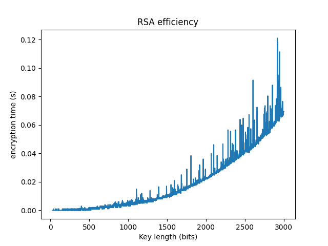
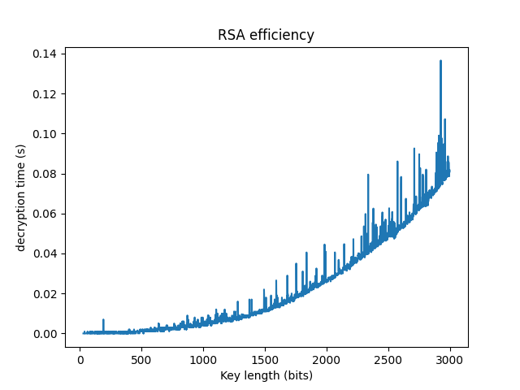
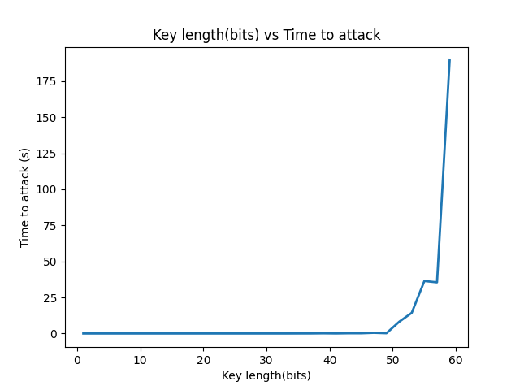

<div align="center">

[](https://github.com/ZeyadTarekk/RSA/contributors)
[](https://github.com/ZeyadTarekk/RSA/issues)
[](https://github.com/ZeyadTarekk/RSA/blob/master/LICENSE)
[](https://github.com/ZeyadTarekk/RSA/network)
[](https://github.com/ZeyadTarekk/RSA/stargazers)
[](https://img.shields.io/github/languages/count/ZeyadTarekk/RSA)

</div>

## 📝 Table of Contents

- [About](#about)
- [Get started](#get-started)
  - [Installation](#Install)
  - [Running](#running)
- [Technology](#tech)
- [Screenshots](#Screenshots)
- [Contributors](#Contributors)
- [License](#license)

## 📙 About <a name = "about"></a>

- RSA (Rivest–Shamir–Adleman) is a public-key cryptosystem that is widely used for secure data transmission.
- In a public-key cryptosystem, the encryption key is public and distinct from the decryption key, which is kept secret (private). An RSA user creates and publishes a public key based on two large prime numbers, along with an auxiliary value. The prime numbers are kept secret.
- Messages can be encrypted by anyone, via the public key, but can only be decoded by
  someone who knows the prime numbers.

- The security of RSA relies on the practical difficulty of factoring the product of two large prime numbers, the "factoring problem". There are no published methods to defeat the system if a large enough key is used.

## 🏁 Getting Started <a name = "get-started"></a>

> This is an list of needed instructions to set up your project locally, to get a local copy up and running follow these
> instructuins.

### Installation <a name = "Install"></a>

1. **_Clone the repository_**

```sh
$ git clone https://github.com/ZeyadTarekk/RSA.git
```

2. **_Navigate to repository directory_**

```sh
$ cd RSA
```

3. **_Install dependencies_**

```sh
pip install sympy
pip install matplotlib
pip install sockets
```

### Running <a name = "running"></a>

1. **_Running the chat_**

```sh
python src/main1.py
python src/main2.py
```

2. **_Running the attacks_**

```sh
python  src/attack.py
```

- 1 for mathematical attack
- 2 To test the key length vs attack time

3. **_Running the efficiency attack_**

```sh
python  src/effeciency.py
```

## 💻 Built Using <a name = "tech"></a>

- **Python**

## 📷 Demo Screenshots <a name = "Screenshots"></a>

<div align="center">

   
   <hr>
   
   <hr>
   </a>
   <hr>
   </a>
   <hr>
   
</div>

## Contributors <a name = "Contributors"></a>

<table>
  <tr>
    <td align="center">
    <a href="https://github.com/ZeyadTarekk" target="_black">
    
    <br />
    <sub><b>Zeyad Tarek</b></sub></a>

  </tr>
 </table>

## License <a name = "license"></a>

> This software is licensed under MIT License, See [License](https://github.com/ZeyadTarekk/RSA/blob/main/LICENSE) for more information.
